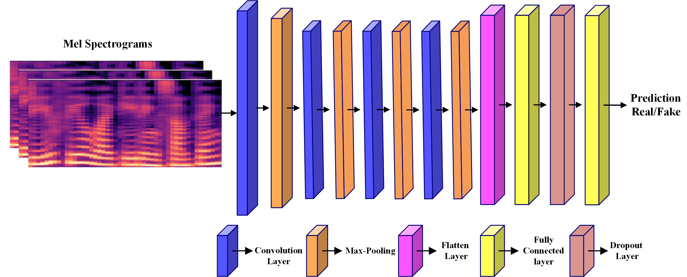
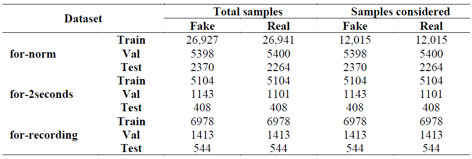
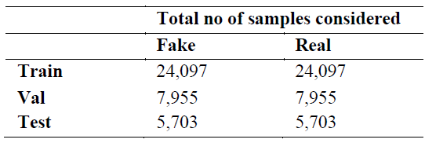
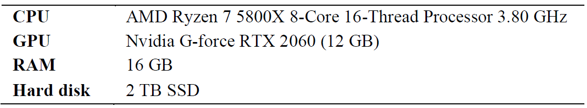
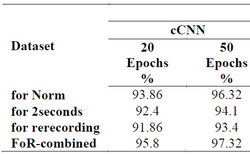
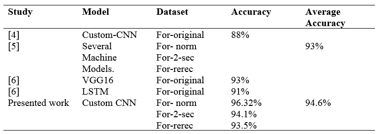

# DeepFake
<b> This work has been developed to fulfil the requisites of the course titled "Neural Networks" under the guidance of Professor Danilo Comminiello and Professor Simone Scardapane. </b>

## <b>TITLE:</b> <b>" Audio Deepfake Detection using Deep Neural Network and Custom Convolutional Neural Networks "</b>

## Authors
- Taiba Majid (2096299)

## Table of Contents
- [Introduction](#introduction)
- [Related Works](#related-works)
- [Research Methodology](#research-methodology)
- [Instructions to Install](#instructions-to-install)
- [Experimental Results and Discussion](#experimental-results-and-discussion)
- [Benchmarking](#benchmarking)
- [References](#references)

## INTRODUCTION
"Despite the growing concern over deepfake videos, the problem of deepfake audio has largely been overlooked. Deepfake audio employs intricate deep learning algorithms, including Deep Neural Networks (DNN) and Custom Convolutional Neural Networks (Custom-CNN), to mimic, edit, or generate a targeted speaker's voice, making it appear as if they have uttered words they have never actually said. The sophistication of voice manipulation has evolved dramatically in recent years, posing not only a risk to automated speaker verification systems but also threatening the security of voice-activated devices in the context of the Internet of Things (IoT) [1]. Two prevalent techniques used for generating deceptive voices are Text-to-Speech synthesis (TTS) and Voice Conversion (VC) [2]. TTS can replicate a highly convincing imitation of any speaker's voice based on the text input provided. On the other hand, VC transforms the source speaker's audio waveform to closely mimic the speech patterns of the target speaker. Despite being entirely computer-generated, the voices produced using TTS and VC synthesis are virtually indistinguishable from genuine human speech, creating a significant challenge to the authenticity of human communication. Furthermore, cloned replay attacks [3] represent a significant hazard to voice biometric systems. Cutting-edge speech synthesis algorithms can manufacture voices that nearly mirror the original speaker, thereby amplifying the likelihood of these attacks. This development gives rise to apprehensions about a potential decline in public trust and provides a conduit for wrongdoers to exploit corporate communications or confidential telephone discussions. The introduction of voice cloning in deepfakes is projected to bring a new degree of intricacy to the process of identifying deepfakes. Considering these risks, it's crucial to transition from strategies that are solely focused on identifying changes in visual cues to those that equally consider auditory fabrications. In the recent past, the Deep Learning (DL) technique known as Convolutional Neural Networks (CNNs) has demonstrated exceptional capabilities in image processing competitions, tasks related to natural language processing, and computer vision, owing to its robust learning competencies. CNNs excel at comprehending spatiotemporal correlations in signals and can autonomously learn data representations by employing multiple stages of feature extraction. In this work, a Custom Convolutional Neural Network (Custom-CNN) detection model is introduced, which consists of four convolutional layers and two fully connected layers. The model is designed based on promising architectures identified in previous work, with a specific aim to detect audio deepfakes. Additionally, Deep Neural Networks (DNNs) have been employed for this purpose. Both DNN and Custom-CNN models are meticulously evaluated using the FoR Deepfake dataset. The models are trained on mel-spectrograms, which are created from three sub-datasets of the FoR dataset, namely 'for-norm,' 'for-2-second,' and 'for-rerecording.' Further, these sub-datasets were amalgamated into a single dataset, which we have designated as 'for-combined."

## RELATED WORKS
The recent advances in Text-to-Speech (TTS) and Voice Conversion (VC) technologies have escalated the potential threat of audio deepfakes to voice biometric systems and society as a whole. Despite certain strategies existing within the field of audio forensics to identify these threats, the current research methods are not entirely perfect. 
Camacho et. al., proposed a dual-stage model to detect fake speech [4]. The first phase involved converting raw data into scatter plots, while subsequent stages were dedicated to data modeling via Convolutional Neural Networks (CNNs). The CNN model was trained on the 'for-original' version of the FoR dataset and achieved an impressive accuracy of 88%, albeit with an Equal Error Rate (EER) of 11%. On the other hand, Iqbal et. al., [5] introduced a methodology centered around choosing the most efficient ML algorithm coupled with optimal feature engineering. This process entailed feature normalization and selection. The 'for-norm', 'for-rerec', and 'for-2-sec' sub-datasets of FoR were used for training six ML techniques. Of these, eXtreme Gradient Boosting (XGB) achieved the highest average accuracy, scoring a remarkable 93%. Furthermore, Hamza et.al.,  [6] conducted extensive experiments using the FoR dataset. Various ML algorithms, trained using mel-frequency cepstral coefficients (MFCC) features, were applied to three sub-datasets from the FoR dataset.

## RESEARCH METHODOLOGY USING DEEP NEURAL NETWORK (DNN)
In the realm of audio deepfake detection, a robust methodology leverages Deep Neural Networks (DNN). The process commences with the collection and preprocessing of a diverse dataset encompassing both genuine and deepfake audio samples. Essential audio features, including Mel-frequency cepstral coefficients (MFCCs) as well as spectral contrast and zero-crossing rate, are extracted from the preprocessed data. The dataset is divided into training, validation, and testing subsets. The DNN architecture is thoughtfully crafted, consisting of input layers for each feature type, followed by multiple hidden layers, each with 128 neurons, employing rectified linear unit (ReLU) activation functions. The output layer is a sigmoid function for binary classification. The model undergoes rigorous training on the training set, with hyperparameters tuned using the validation set. Evaluation metrics, such as accuracy and precision, assess its performance. Optionally, post-processing techniques and threshold tuning are applied to further enhance results. Finally, the trained DNN, with its multifaceted feature inputs and structured layers, is deployed for audio deepfake detection.

## RESEARCH METHODOLOGY USING CONVOLUTIONAL NEURAL NETWORK (CNN)
A comprehensive experimental assessment is carried out on three distinct sub-datasets from the FoR deepfake dataset: 'for-norm', 'for-2-sec', and 'for-rerec', utilizing the suggested custom Convolutional Neural Network (CNN). The proposed approach focuses on distinguishing between genuine and deceptive audios. 
To begin, the audio files in the datasets are subject to pre-processing and a sequence of transformations. The processed audio files are then transmuted into mel-spectrograms, enabling an image-centric method for the necessary classification task. Finally, these produced mel-spectrograms serve as the basis for training and testing the introduced model, the custom CNN

### Mel-spectrogram
A mel-spectrogram is a visual depiction of an audio signal that conveys both time and frequency data, thereby facilitating analysis of features in both the time and frequency domains. It applies the mel scale to imitate the nonlinear frequency perception inherent to the human auditory system, which operates in a logarithmic manner and captures the most perceptually significant elements within audio content. Creating a mel-spectrogram involves partitioning the audio signals into overlapping frames via a windowing function. From there, the Short-Term Frequency Transform (STFT) is computed to derive the spectrograms. Following this, mel-scale filter banks are utilized to transition the frequency axis to the mel scale. Finally, the logarithm of the filter bank energies is calculated to yield the desired mel-spectrogram.

 

   

   

   

<b>Mel-spectrograms Real and Fake Audios </b>

  
### Custom – Convolutional Neural Network (Custom-CNN)
Convolutional Neural Networks (CNNs) are highly favored in the field of computer vision due to their scalability and reliability. In this study, we introduce a bespoke CNN, referred to as Custom-CNN, which comprises four convolution layers, four pooling layers, a flatten layer, two fully connected layers, and a dropout layer.
The mel-spectrograms, derived from the three sub-datasets of the FoR dataset, serve as the input to the first layer of our Custom-CNN. The first convolution layer employs a kernel size of (3x3) with 32 filters, while the second layer incorporate 64 filters with a kernel size of (3x3), and the third final convolution layer has 128 filters with a kernel size of (3x3). Every convolution layer is succeeded by a ReLU activation unit and a pooling layer of size (2x2) with identical padding and a stride of 2.The output from the final pooling layer is relayed to the flatten layer where the 3D volume is transformed into a 1D vector. The flatten layer is succeeded by two fully connected layers, containing 512 neurons. To mitigate the risk of overfitting, a dropout layer is incorporated after the first fully connected layer, with a dropout rate of 50%. The concluding fully connected layer integrates a sigmoid function, responsible for the classification task of discerning genuine and fake audios.

 

   

<b>Proposed Custom-Convolutional Neural Network </b>

## INSTRUCTIONS TO INSTALL

### ENVIRONMENT AND DEPENDENCIES
This project requires Python 3.9 and the following Python libraries:

•	NumPy

•	TensorFlow

•	Keras

•	Matplotlib

•	Librosa

Python can be installed from the official website.
For installing these libraries, Anaconda, a pre-packaged Python distribution that contains most of the necessary libraries and software for this project, is recommended. Once you have Python and Anaconda installed, execute the following commands in the terminal to install the necessary libraries:

<b>
  conda install tensorflow
  
  conda install keras
  
  conda install librosa
  
  conda install matplotlib
  
  conda install numpy
</b>

### CONFIGURABLE OPTIONS or PARAMETERS
In this project, you may need to adjust certain parameters depending on your specific use case. These may include parameters related to the spectrogram generation, CNN architecture or training parameters.
As an example, the parameters of the CNN like number of layers, types of layers (Conv2D, Dense, etc.), layer sizes, activation functions, optimizer, and others can be adjusted to achieve better performance or to suit specific use cases.
You might also need to adjust parameters for the librosa function calls, which are used to generate spectrograms from audio files. These parameters include hop length, window size, etc.

<b> Note: Ensure to provide suitable paths to your audio files and model files in the required areas of the code.</b>

### EXECUTION INSTRUCTIONS
Once Python and the necessary libraries are installed, and you have cloned or downloaded this repository on your machine, navigate to its directory from the terminal.
Execute the Jupyter notebook by typing jupyter notebook in your terminal and hitting Enter. This will open up the Jupyter interface in your web browser, from where you can open and run the project notebook.
The notebook contains the code as well as step-by-step instructions for the project. You can execute each cell in the notebook by selecting it and pressing Shift+Enter.
Remember to update the paths to the dataset and other necessary files, and adjust any parameters as needed before running the notebook.

## EXPERIMENTAL RESULTS AND DISCUSSION
In this study, we have executed numerous experiments using the custom Convolutional Neural Network (Custom-CNN) trained on the sub-datasets of the FoR deepfake dataset: 'for-norm', 'for-2-second', and 'for-rerecording'. Detailed accounts of the dataset, the experimental setup, and the resulting outcomes are presented in the subsequent subsections.

### Fake or Real Dataset (FoR)
The FoR dataset is an audio deepfake dataset that comprises over 111,000 genuine utterances gathered from human speech recordings of all genders, and more than 87,000 deceptive utterances produced by seven different Text-to-Speech (TTS) systems. This dataset is subdivided into four different versions based on pre-processing: 'for-original', 'for-norm', 'for-2-second', and 'for-rerecording'.
In our research, we used three versions of the FoR dataset: 'for-norm', 'for-2-second', and 'for-rerecording'. These datasets were already split into training, validation, and testing sets, and they were used as such during the evaluation phase. The total count of samples in the dataset and the number of samples used for the experimental analysis are listed in Table 1.                  

  

   

Additionally, we combined these three sub-datasets and named it as for-combined, for extensive experimental analysis. We also used data augmentation for the built for-combined dataset. Table 2 shows the number of samples in the given dataset. 

 

   

### Experimental Setup
The specifics of the hardware setup can be found in Table 3. All experiments involving the 'for-norm', 'for-2-second', 'for-rerecording', and 'for-combined' datasets were conducted using Jupyter Notebook. These datasets were used to train Custom-CNN. Mel-spectrograms, amounting to over 90,000, were utilized as input for all the models. For the model, a batch size of 32 was maintained.
The data in the datasets had already been segmented into training, testing, and validation sets, and we adhered to these same proportions for the evaluation process. The models were trained over two different epochs durations, namely 20 and 50. We assessed the performance of the models based on their accuracy during training, validation, and testing phases. To facilitate comparison between the models, we have tabulated the results for each classification algorithm.  

  

   

### Experiments using Proposed Custom-CNN
The proposed Custom-CNN was trained and tested on for-norm, for-2second, for-rerecording, and for-combined. Table 4 shows the testing accuracy of all the datasets considered. With training epochs of 50, Custom-CNN achieved a highest of 97.23% on for-combined dataset and 96.32% on for-norm dataset. For combined achieved 95.80% of accuracy highest among all datasets when trained with 20 epochs. For-rerec got less accuracy compared to other datasets with 91.86% and 93.4% with 20 and 50 epochs respectively. The training accuracy for each dataset was in between 97% to 100%. 

  

   

## BENCHMARKING
When the experimental conditions (dataset, models) used in the subsequent study are the same as those used in the literature, it is much simpler to compare the results. To the best of our knowledge, the three sub-datasets of the FoR dataset have not been the subject of any previous research using CNN. [4] trained Custom-CNN on for-original dataset and achieved an accuracy of 88%. [5] and [6] used various machine learning algorithms trained on three subsets of FoR datasets, both the studies used hand-crafted features. [6] also implemented VGG16 and LSTM but were trained on for-original version and achieved an accuracy of 93% and 91% respectively. In [5], the highest average accuracy 93% was achieved by XGB on three subsets of FoR dataset, therefore, we also calculated the average accuracy of the presented model for the comparative analysis of the two works. 

  

   

## REFERENCES
1.	Akhtar, Zahid. "Deepfakes Generation and Detection: A Short Survey." Journal of Imaging 9.1 (2023): 18.
2.	K. M. Malik, H. Malik, and R. Baumann, "Towards vulnerability analysis of voice-driven interfaces and countermeasures for replay attacks," in 2019 IEEE Conference on Multimedia Information Processing and Retrieval (MIPR), 2019, pp. 523-528: IEEE.
3.	Khanjani, Zahra, Gabrielle Watson, and Vandana P. Janeja. "Audio deepfakes: A survey." Frontiers in Big Data 5 (2022).
4.	S. Camacho, D. M. Ballesteros, and D. Renza, "Fake speech recognition using deep learning," in Applied Computer Sciences in Engineering: 8th Workshop on Engineering Applications, WEA 2021, Medellín, Colombia, October 6–8, 2021, Proceedings 8, 2021: Springer, pp. 38-48.
5.	F. Iqbal, A. Abbasi, A. R. Javed, Z. Jalil, and J. Al-Karaki, "Deepfake Audio Detection via Feature Engineering and Machine Learning," 2022
6.	A. Hamza et al., "Deepfake Audio Detection via MFCC Features Using Machine Learning," IEEE Access, vol. 10, pp. 134018-134028, 2022.

